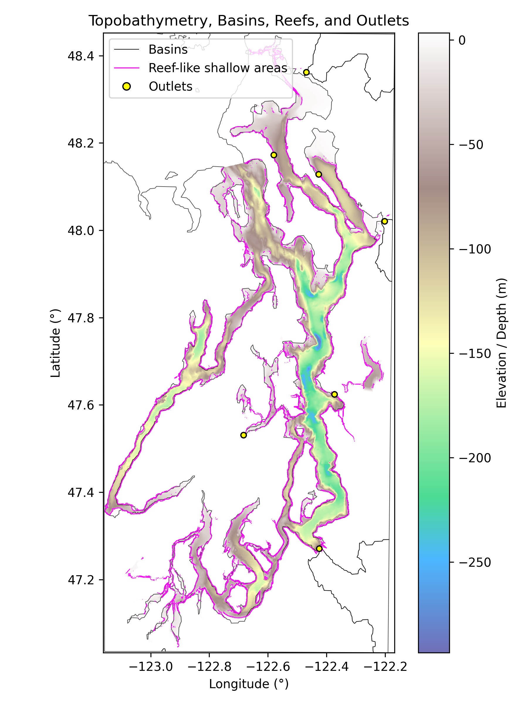

# Topobathymetry + Watershed Integration Pipeline

Workflow integrating bathymetry and HydroBASINS data to compute topobathymetry, slopes, reef-like shallow features, and watershed outlet momentum vectors.

### Overview

This repository contains a geospatial processing pipeline that integrates regional bathymetry, HydroSHEDS terrain, and HydroBASINS watershed boundaries to produce harmonized topobathymetric surfaces, terrain slopes, shallow-reef morphological features, and watershed outlet discharge/momentum vectors.

The workflow:

- Aligns NOAA bathymetry with HydroSHEDS DEMs

- Constructs a fused topobathymetric DEM with consistent CRS, nodata handling, and aligned grids

- Computes terrain slopes from the merged DEM

- Identifies basin–sea outlet points via raster-to-vector water boundary intersection

- Derives synthetic discharge, velocity, and momentum vectors for each watershed outlet
  
  - Detects shallow, reef-like bathymetry structures using depth–slope morphological filters

- Exports processed layers as compressed GeoTIFFs and GeoParquets, suitable for large-scale analytics

- Generates geographic visualizations integrating all layers

### Study Area & Data

The demonstration focuses on a subsection of Puget Sound (Mt. Vernon → Olympia), using:

- NOAA regional bathymetry

- HydroSHEDS/HydroBASINS terrain and watershed boundaries

- Synthetic outlet hydrodynamics for illustrative purposes

## **Example Output (QC Map)**

This map is generated automatically when running the pipeline and shows:

- fused **topobathymetry**,

- extracted **reef-like shallow areas**,

- clipped **HydroBASINS polygons**, and

- computed **outlet points**.

<p align="center">
 
</p>

# Running the Demo

### **1. Clone the repository**

`git clone https://github.com/yourusername/yourrepo.git cd bathymetry_demo`

### **2. Download required datasets**

The raw data **cannot be included in this repo** because the files exceed GitHub’s size limits.

Inside `data/raw/`, each subfolder contains:

- the download link

- the exact filename needed

- where to place the extracted data

You must download NOAA, HydroSHEDS, and HydroBASINS yourself before running the pipeline.

### **3. Execute the pipeline**

`python main.py`

The demo is small and should run even on older or low-power machines.

# **Pipeline Overview**

### **1. Topobathy Construction**

- GEBCO bathymetry is clipped to HydroSHEDS’ bounding box.

- Both datasets are reprojected to a UTM CRS.

- Land (from HydroSHEDS) is merged with underwater bathymetry (from GEBCO).

- Saved to `data/intermediate/topobathy/`.

### **2. Basins & Outlet Extraction**

- HydroBASINS polygons are clipped to the study area.

- A water mask from the topobathy identifies where basins meet the ocean.

- Outlet points are computed and synthetic discharge + momentum vectors added.

- Saved to `data/intermediate/basins/`.

### **3. Slope & Zonal Statistics**

- Terrain slope is computed from the fused DEM.

- Per-basin statistics (mean, median, max, std) are computed via rasterization.

- Saved to `data/intermediate/topobathy/`.

### **4. Reef-Like Feature Detection**

- Cells meeting depth (−30–0 m) and slope (5–30°) criteria are extracted.

- Polygonized, clipped to water, and intersected with basins.

- Saved to `data/intermediate/reef/` and `data/processed/`.

### **5. Final Outputs**

`plotting.py` creates a QC visualization of:

- topobathymetry

- basins

- reef candidates

- outlet points

and writes:

- `data/processed/puget_sound_qc_map.png`

- `basins_with_slopes.parquet`

- `reef_candidates.parquet`

# Folder Structure

```
data/
├── raw/ # User-downloaded datasets (not included)
├── intermediate/ # Auto-generated GeoTIFF/Parquet layers
└── processed/ # Final plot + cleaned basin/reef outputs
```
